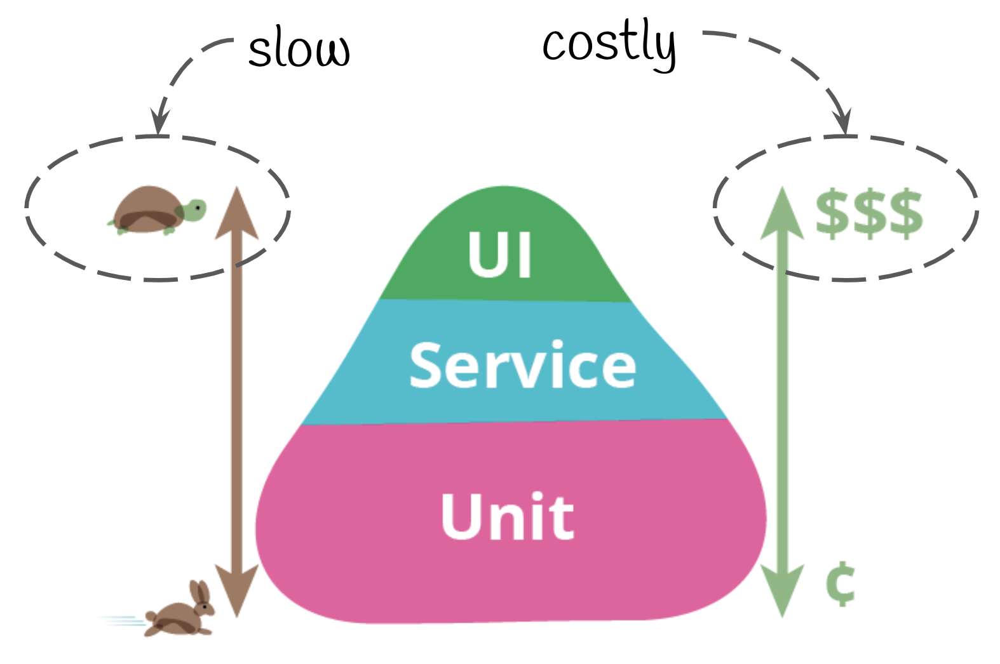

autoscale: true


[.header: #152238, alignment(left)]
# Testing in go: unit → end2end
#### Or, How I think about testing in 2021
##### Anthony Alaribe (@tonyalaribe)

---
## What will this talk Cover?
---
### What is *testing*?
---
### Why should you care?
--- 
### Types of tests
[.column]
- Accessibility testing
- Acceptance testing
- Black box testing
- End-to-end testing
- Functional testing
- Interactive testing
- Integration testing
- Load testing
- Non functional testing

[.column]
- Performance testing
- Regression testing
- Sanity testing
- Security testing
- Smoke testing
- Stress testing
- Unit testing
- White box testing
- And many more...

^ In this talk I will introduce you to all of these
^ Just kidding

---
### Types of Tests I actually write
- Load tests
- Profiling/Benchmarks

- Unit tests
- Integration tests
- End to End tests

--- 


---

### Let's build an app

[.code-highlight: 1]
[.code-highlight: 2]
[.code-highlight: 3]
[.code-highlight: 4]
[.code-highlight: 5]
[.code-highlight: 6]
[.code-highlight: 7]
```
  [UserReq]->
  [Authenticate]->
  [BuildInternalRequestObject] ->
  [makeDBInsert] ->
  [CallThirdparty] -> 
  [BuildResponse] -> 
  [UserReqResponse]

```

---
### First, our service
---

[.code-highlight: 2]
[.code-highlight: 3]
[.code-highlight: 4]
[.code-highlight: 7-9]
[.code-highlight: all]
``` go
func main() {
  http.HandleFunc("/submit", authMiddleware(handlerFunc))
  http.HandleFunc("/notloggedIn", notLoggedInHandlerFunc)
  log.Fatal(http.ListenAndServe(":8080", nil))
}

func notLoggedInHandlerFunc(w http.ResponseWriter, r *http.Request){
  w.Write([]byte("not logged in"))
}
```
---
### Auth middleware
---

[.code-highlight: 2-4]
[.code-highlight: 8-13]
[.code-highlight: all]
``` go
// Check if a user request is authenticated
func authFunction(r *http.Request) bool {
  return r.URL.Query().Get("auth") == "ABC"
}

func authMiddleware(next http.HandlerFunc) http.HandlerFunc {
  return func(w http.ResponseWriter, r *http.Request) {
    if !authFunction(r) {
      http.Redirect(w, r, "/notloggedIn", http.StatusUnauthorized)
      return
    }
    // User authenticated successfully
    next(w, r)
  }
}
```
--- 
[.autoscale: true]

# Let's see the handler

^ Now have the the auth middleware  and the main function, 
we just need to implement the Handler

---

[.code-highlight: all]
[.code-highlight: 4-8]
[.code-highlight: 10-14]
[.code-highlight: 16-20]
[.code-highlight: 22]
``` go
func handlerFunc(w http.ResponseWriter, r *http.Request) {
	ctx := r.Context()

	reqCtx, err := buildRequestContextAndValidate(r)
	if err != nil {
		fmt.Fprintf(w, "There was a validation error; %v", err)
		return
	}

	reqID, err := insertRequestToDB(ctx, reqCtx)
	if err != nil {
		fmt.Fprintf(w, "There was an error inserting request; %v", err)
		return
	}

	err = sendNotification(ctx, reqID, reqCtx, notificationURL)
	if err != nil {
		fmt.Fprintf(w, "There was an error sending notification; %v", err)
		return
	}

	fmt.Fprintf(w, "Success in Handling  request")
}
```
---

Now how do we test this?

--- 

## Unit Testing
- Self contained
- Fast to run
- Easy to write
- Faster feedback loops
- Our stand in for REPL driven development
- GO unit test support is 👍


^ I love unit tests. 
^ They are usually self-contained tests, that test singular functionality separately from anything else. 
^ In Go, these are fast to run, and pretty much should rarely change after they have been written. 
^ If you assume the tests as a pyramid, then unit tests would be at the bottom and the largest group. 
^ It is always a good idea to write more unit tests than the other tests, because unit tests are fast to run, and hence you get a faster feedback look. They are most important when working on individual functionality or units of logic, and can help you iterate on your implementations quickly, without having to reexecute the entire application. Those of us who are familiar with repl based development from the lisp/haskell world, would notice that unit testing can be used for similar benefits when developing.


---
### Recall

``` go
// Check if a user request is authenticated
func authFunction(r *http.Request) bool {
  return r.URL.Query().Get("auth") == "ABC"
}
```
---
## In main_test.go

[.code-highlight: all]
[.code-highlight: 1,16]
[.code-highlight: 2,13]
[.code-highlight: 3-7]
[.code-highlight: 9-12]
```go
func TestAuthFunction(t *testing.T) {
  t.Run("should return false when auth param is absent", func(t *testing.T) {
    req, err := http.NewRequest("GET", "/submit", nil)
    if err!=nil{
      t.Error("go an error where nil was expected", err)
      return
    }

    if authFunction(req)  {
      t.Error("got true where false was  expected from authFunction")
      return
    }
  })

 // <Rest of the tests go here>
}
```

---
## We then run the test

[.code-highlight: 1]
[.code-highlight: 3,8]
```sh
$ go test -v ./ -run=TestAuthFunction

=== RUN   TestAuthFunction
=== RUN   TestAuthFunction/should_return_false_when_auth_param_is_absent
--- PASS: TestAuthFunction (0.00s)
    --- PASS: TestAuthFunction/should_return_false_when_auth_param_is_absent (0.00s)
PASS
ok      ./devopscon-testing 0.025s
```

---
### Let's use an assertion library
https://github.com/stretchr/testify

---

```go
  t.Run("should return false when auth param is absent", func(t *testing.T) {
    req, err := http.NewRequest("GET", "/submit", nil)
    if err!=nil{
      t.Error("go an error where nil was expected", err)
      return
    }

    if authFunction(req)  {
      t.Error("got true where false was  expected from authFunction")
      return
    }
  })

  t.Run("should return false when auth param is incorrect", func(t *testing.T) {
    req, err := http.NewRequest("GET", "/submit?auth=XYZ", nil)
    assert.NoError(t, err)
    assert.False(t, authFunction(req))
  })
```

---

```go

func TestAuthFunction(t *testing.T) {
	t.Run("should return false when auth param is absent", func(t *testing.T) {
		req, err := http.NewRequest("GET", "/submit", nil)
		if err != nil {
			t.Error("go an error where nil was expected", err)
			return
		}
		if authFunction(req) {
			t.Error("got true where false was  expected from authFunction")
			return
		}
	})
	t.Run("should return false when auth param is incorrect", func(t *testing.T) {
		req, err := http.NewRequest("GET", "/submit?auth=XYZ", nil)
		assert.NoError(t, err)
		assert.False(t, authFunction(req))
	})
	t.Run("should return true when auth param is correct", func(t *testing.T) {
		req, err := http.NewRequest("GET", "/submit?auth=ABC", nil)
		assert.NoError(t, err)
		assert.True(t, authFunction(req))
	})
}
```

---
```sh
$ go test -v ./ -run=TestAuthFunction
=== RUN   TestAuthFunction
=== RUN   TestAuthFunction/should_return_false_when_auth_param_is_absent
=== RUN   TestAuthFunction/should_return_false_when_auth_param_is_incorrect
=== RUN   TestAuthFunction/should_return_true_when_auth_param_is_correct
--- PASS: TestAuthFunction (0.00s)
    --- PASS: TestAuthFunction/should_return_false_when_auth_param_is_absent (0.00s)
    --- PASS: TestAuthFunction/should_return_false_when_auth_param_is_incorrect (0.00s)
    --- PASS: TestAuthFunction/should_return_true_when_auth_param_is_correct (0.00s)
PASS
ok      ./devopscon-testing    0.025s

```

---
### What about TDD(Table Driven Tests)?

---
[.code-highlight: all]
[.code-highlight: 8-9, 13]
```go
type requestCtx struct {
	Name  string
	Age   int
	Email string
}

func buildRequestContextAndValidate(r *http.Request) (requestCtx, error) {
	ageStr := r.URL.Query().Get("age")
	age, err := strconv.Atoi(ageStr)
	if err != nil {
		return requestCtx{}, errors.Wrap(err, "age is not an integer")
	}
	if age < 18 {
		return requestCtx{}, errors.New("user is below 18 yr")
	}

	return requestCtx{
		Name:  r.URL.Query().Get("name"),
		Age:   age,
		Email: r.URL.Query().Get("email"),
	}, nil
}
```
---
```go
func TestBuildRequestContextAndValidate(t *testing.T) {
	testCases := map[string]struct {
		urlToValidate    string
		expectedURLError string
		expectedError    string
	}{
		"happy path with valid age and email": {
			urlToValidate: "/submit?auth=ABC&age=19&name=tony&email=abc@xyz.com",
		},
		"error: age is not a number": {
			urlToValidate: "/submit?auth=ABC&age=agexx&name=tony&email=abc@xyz.com",
			expectedError: "age is not an integer: strconv.Atoi: parsing \"agexx\": invalid syntax",
		},
		"error: age is should be above 18": {
			urlToValidate: "/submit?auth=ABC&age=12&name=tony&email=abc@xyz.com",
			expectedError: "user is below 18 yr",
		},
	}

	for k, v := range testCases {
		t.Run(k, func(t *testing.T) {
			req, err := http.NewRequest("GET", v.urlToValidate, nil)
			if len(v.expectedURLError) == 0 {
				assert.NoError(t, err)
			} else {
				assert.EqualError(t, err, v.expectedURLError)
			}

			_, err = buildRequestContextAndValidate(req)
			if len(v.expectedError) == 0 {
				assert.NoError(t, err)
			} else {
				assert.EqualError(t, err, v.expectedError)
			}
		})
	}
}
```
---
[.code-highlight: all]
[.code-highlight: 1-5]
[.code-highlight: 6,9,13]
[.code-highlight: 7,10,14]
[.code-highlight: 11,15]
```go
  testCases := map[string]struct {
		urlToValidate    string
		expectedURLError string
		expectedError    string
	}{
		"happy path with valid age and email": {
			urlToValidate: "/submit?auth=ABC&age=19&name=tony&email=abc@xyz.com",
		},
		"error: age is not a number": {
			urlToValidate: "/submit?auth=ABC&age=agexx&name=tony&email=abc@xyz.com",
			expectedError: "age is not an integer: strconv.Atoi: parsing \"agexx\": invalid syntax",
		},
		"error: age is should be above 18": {
			urlToValidate: "/submit?auth=ABC&age=12&name=tony&email=abc@xyz.com",
			expectedError: "user is below 18 yr",
		},
	}
```

---
[.code-highlight: all]
[.code-highlight: 1, 17]
[.code-highlight: 2, 16]
[.code-highlight: 1, 17]
[.code-highlight: 3-8]
[.code-highlight: 10-15]
```go
	for k, v := range testCases {
		t.Run(k, func(t *testing.T) {
			req, err := http.NewRequest("GET", v.urlToValidate, nil)
			if len(v.expectedURLError) == 0 {
				assert.NoError(t, err)
			} else {
				assert.EqualError(t, err, v.expectedURLError)
			}

			_, err = buildRequestContextAndValidate(req)
			if len(v.expectedError) == 0 {
				assert.NoError(t, err)
			} else {
				assert.EqualError(t, err, v.expectedError)
			}
		})
	}
```

^ In this code example, you would notice that I list out the test cases, input and expected output, and then i have a range loop which checks these test cases. 
^ In this way, we can have many many test cases defined for the `buildRequestContextAndValidate(req)` without having to write a lot of boilerplate.

---

```sh
$ go test -v ./ -run TestBuildRequestContextAndValidate

=== RUN   TestBuildRequestContextAndValidate
=== RUN   TestBuildRequestContextAndValidate/happy_path_with_valid_age_and_email
=== RUN   TestBuildRequestContextAndValidate/error:_age_is_not_a_number
=== RUN   TestBuildRequestContextAndValidate/error:_age_is_should_be_above_18
--- PASS: TestBuildRequestContextAndValidate (0.00s)
    --- PASS: TestBuildRequestContextAndValidate/happy_path_with_valid_age_and_email (0.00s)
    --- PASS: TestBuildRequestContextAndValidate/error:_age_is_not_a_number (0.00s)
    --- PASS: TestBuildRequestContextAndValidate/error:_age_is_should_be_above_18 (0.00s)
PASS
ok      ./devopscon-testing    0.025s
```

---
# Integration Tests

^ Integration test is a little difficult to define, and any definition you pick will include some gray areas. 

---

### Usually involves talking to third party or external systems

^ But just going by the name, integration tests would usually check/test the integration with other systems. This can be database, can be msg queues or even just a third party service. Usually you need to spin up some extra infrastructure to deal with these kind of tests. Eg spinning up a test database or a mock server.

---

### It would still involve testing almost individual units or groups of units.

--- 
### How we write integration tests in Go

---
### We just write tests :) 

---

### Use `<filename>_integration_test.go` file extension

---
### Start the file with 

``` go
// +build integration

Package <package_name> 
```

---
### Run the tests by specifying the tags

``` sh
$ go test --tags=integration ./
```

---
### Let's write an integration test

---

[.code-highlight: all]
[.code-highlight: 2-6]
[.code-highlight: 8-9]
[.code-highlight: 11-13]
```go
func sendNotification(ctx context.Context, reqID int, reqCtx requestCtx, baseURL string) error {
	res, err := req.Post(baseURL+"/mail", req.BodyJSON(req.Param{
		"name":   reqCtx.Name,
		"email":  reqCtx.Email,
		"req_id": reqID,
	}))

	responseMap := map[string]interface{}{}
	res.ToJSON(&responseMap)

	if len(responseMap["email"].(string)) == 0 {
		return errors.New("invalid response from notification provider")
	}
	return err
}

```

---

[.code-highlight: all]
[.code-highlight: 1-2]
[.code-highlight: 6, 17-18]
[.code-highlight: 5,7]
[.code-highlight: 8-13]
[.code-highlight: 14-16]
[.code-highlight: 20-24]
[.code-highlight: 25-26]
```go
var updateGolden = flag.Bool("update_golden", false, 
"set to update_golden flag to true if you want to hit the live server")

func TestSendNotification(t *testing.T) {
  var calledRemoteServer bool
	ts := httptest.NewServer(http.HandlerFunc(func(w http.ResponseWriter, r *http.Request) {
    calledRemoteServer = true
		if *updateGolden {
			res, err := req.Post(notificationURL+"/mail", r.Body)
			assert.NoError(t, err)
			err = os.WriteFile("testdata/notification.golden", res.Bytes(), 0666)
			assert.NoError(t, err)
		}
		data, err := os.ReadFile("testdata/notification.golden")
		assert.NoError(t, err)
		w.Write(data)
	}))
	defer ts.Close()

	err := sendNotification(context.Background(), 22, requestCtx{
		Name:  "Test User",
		Age:   33,
		Email: "user@ex.com",
	}, ts.URL)
	assert.NoError(t, err)
  assert.True(t, calledRemoteServer)
}
```

--- 
## End to End Tests

---
- Usually tests the entire application like a user
- Could be api tests
- Could be UI tests that actually click around in an app

---
### Side effects
- Can be slow
- Can be flaky
- Can be harder to verify

--- 
## BDD and e2e testing with Ginkgo/Gomega

---
### Use `<filename>_integration_test.go` file extension

---
### Start the file with 

``` go
// +build e2e 

Package <package_name> 
```
---

[.code-highlight: 1]
[.code-highlight: 3-7]
[.code-highlight: 9,22]
[.code-highlight: 10-14]
[.code-highlight: 17-20]
```go
const rootURL = "http://localhost:8080"

func TestE2E(t *testing.T) {
	defer GinkgoRecover()
	RegisterFailHandler(Fail)
	RunSpecs(t, "Devopscon test Suite")
}

var _ = Describe("Here we describe the test", func() {
	It("should fail with a wrong auth", func() {
		r, err := req.Get(rootURL + "/submit?auth=WRONG&age=19&name=tony&email=abc@xyz.com")
		Expect(err).To(BeNil())
		Expect(r.Response().StatusCode).To(Equal(401))
	})

	It("should succeed", func() {
		r, err := req.Get(rootURL + "/submit?auth=ABC&age=19&name=tony&email=abc@xyz.com")
		Expect(err).To(BeNil())
		Expect(r.Response().StatusCode).To(Equal(200))
		Expect(r.String()).To(Equal("Success in Handling  request"))
	})
})
```

---
### Run the tests by specifying the tags

``` sh
$ go test --tags=integration ./ -run=TestE2E


=== RUN   TestE2E
Running Suite: Geolocator Suite
===============================
Random Seed: 1623694664
Will run 2 of 2 specs

••
Ran 2 of 2 Specs in 0.568 seconds
SUCCESS! -- 2 Passed | 0 Failed | 0 Pending | 0 Skipped
--- PASS: TestE2E (0.57s)
PASS
ok      github.com/deliveryhero/testing-talk    0.598s

```

---
## Recap
- Unit tests for most things. Write a lot of them, then integration and End to
  End tests
- You can test in go without any special libraries. But libraries help
- Leverage golden/cache files when testing against real world services
- Tests are just code. You can do anything in tests.

---
## Resources
- https://golang.org/pkg/testing/
- https://www.toptal.com/go/your-introductory-course-to-testing-with-go

## Slides are Available at
- https://github.com/tonyalaribe/testing-talk

